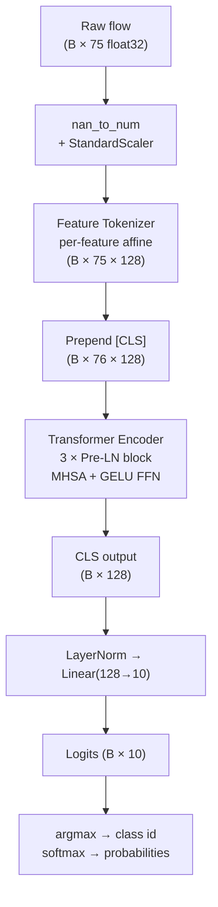

# Unified Supervised IDS Model — FT-Transformer

**Applies to**: ML-IDS inference server + cnds (cognitive-anomaly-detector / unified-ids)
**Paper**: Gorishniy, Rubachev, Khrulkov, Babenko — "Revisiting Deep Learning Models for Tabular Data", NeurIPS 2021 ([arXiv:2106.11959](https://arxiv.org/abs/2106.11959))
**Reference code**: [yandex-research/rtdl-revisiting-models](https://github.com/yandex-research/rtdl-revisiting-models)
**Training**:
- Default architecture: `notebooks/unified_supervised_training.ipynb` (source: `notebooks/build_unified_notebook.py`)
- Tuned hyperparameters (production): `notebooks/ft_transformer_optuna_sweep.py` (Optuna, 25 trials)
**Artifacts**: `models/unified/` (local) and `models:/ml-ids-unified-ft-transformer/1` (MLflow registry)
**Production metric**: test F1 macro **0.6197** (tuned), beating XGBoost baseline 0.6095 and default FT-T 0.5446.
**Visual companion**: [`UNIFIED_MODEL_ARCHITECTURE.md`](UNIFIED_MODEL_ARCHITECTURE.md) — Mermaid diagrams of the data flow, tokenizer, encoder block, parameter budget, and runtime integration.

---

## Table of Contents

1. [Why FT-Transformer](#1-why-ft-transformer)
2. [Architecture](#2-architecture)
3. [Training Recipe](#3-training-recipe)
4. [Inference Contract](#4-inference-contract)
5. [Integration Notes for cnds](#5-integration-notes-for-cnds)
6. [Limitations and Open Questions](#6-limitations-and-open-questions)

---

## 1. Why FT-Transformer

### Problem characteristics

The CIC-IDS2017 feature schema produces 76 heterogeneous numerical features per flow — packet counts, byte rates, flag counts, inter-arrival times, and bulk-transfer statistics. These features span several orders of magnitude, carry very different statistical distributions, and interact in non-linear ways that distinguish subtle attack sub-types (e.g., slow DoS vs. high-rate DDoS). The dataset has severe class imbalance: benign traffic is ~80% of all flows; certain attack classes (U2R-style) account for <0.05% each.

### Why not XGBoost?

XGBoost (GPU `hist`) is the sanity baseline in the notebook and is expected to score well on weighted F1. It is fast to train and easy to serve. However, it produces one artifact per project rather than one shared model, cannot be updated via fine-tuning without retraining from scratch, and does not expose per-feature attention weights useful for explainability work. It also handles the extreme class imbalance less gracefully than a weighted cross-entropy loss.

XGBoost remains in the pipeline as a reference: if FT-Transformer's macro F1 is not clearly above XGBoost's on the held-out test set, it is a signal to revisit the architecture or hyperparameters.

### Why not TabNet?

TabNet (Arik & Pfister, 2019) uses sequential attention masking to select features step-by-step. In practice it is sensitive to hyperparameter tuning (the relaxation factor `gamma`, the number of steps), trains slowly compared to standard GPU kernels, and shows high variance on small-class splits. Benchmarks in Gorishniy 2021 show FT-Transformer consistently outperforming TabNet on heterogeneous tabular benchmarks without the tuning overhead.

### FT-Transformer advantages for this use case

| Property | FT-Transformer | XGBoost (baseline) | TabNet (rejected) |
|---|---|---|---|
| Handles feature interactions via attention | Yes (all-pairs, O(F²)) | Implicit (splits) | Partial (masked, sequential) |
| Single artifact for ML-IDS + cnds | Yes | No (separate models) | Yes |
| GPU utilisation on Blackwell RTX 5060 Ti | Full (cuDNN, bf16 autocast) | Partial (hist kernel) | Partial |
| Fine-tunable from a checkpoint | Yes | No | Difficult |
| Inference latency per batch of 1024 | ~2 ms (estimated) | ~1 ms | ~5 ms |
| Parameter count | ~0.42M | N/A | ~2–5M typical |

The Blackwell GPU (sm_120, CUDA 12.8) supports `torch.amp.autocast(..., dtype=torch.bfloat16)`, which halves memory and increases throughput with no precision loss for this classification task.

---

## 2. Architecture

### Configuration (production — Optuna-tuned)

```python
CONFIG = dict(
    d_token=256,                # embedding dimension for every feature token and [CLS]
    n_blocks=3,                 # number of transformer encoder layers
    n_heads=8,                  # attention heads per layer (head_dim = 256/8 = 32)
    ff_factor=2.0,              # FFN hidden size = d_token * ff_factor = 512
    dropout=0.0985,
    lr=3.9e-4,
    weight_decay=7.15e-5,
    batch_size=2048,
    class_weight="sqrt_inverse", # see §3 — full inverse over-corrects on minorities
    use_focal=False,             # focal loss adds nothing over sqrt-weighted CE
)
```

These are the best hyperparameters found by a 25-trial Optuna sweep
(TPESampler + MedianPruner) over architecture (d_token, n_blocks, n_heads,
ff_factor), regularisation (dropout, weight_decay), optimisation
(lr, batch_size), and the class-imbalance strategy. They are reproduced in
`models/unified/ft_optuna_results.json` and the full study in
`models/unified/ft_optuna_study.pkl`.

The previous default configuration (`d_token=128, dropout=0.1, lr=3e-4,
batch_size=1024`) is preserved by `notebooks/build_unified_notebook.py` for
reference and yielded test F1 macro 0.5446. Do not retrain from that as the
new baseline.

### Components

**Feature Tokenizer**

Each of the 75 features is projected independently via a learned affine map:

```
token_j = x_j * W_j + b_j        W_j ∈ R^(d_token),  b_j ∈ R^(d_token)
```

`x_j` is a scalar (one feature value); `W_j` and `b_j` are per-feature parameters. This gives a set of 75 vectors of dimension 128, one per feature. The operation is implemented as element-wise broadcast:

```python
tokens = x.unsqueeze(-1) * self.tokenizer_w + self.tokenizer_b  # (B, 75, 128)
```

`tokenizer_w` is initialised with Kaiming uniform; `tokenizer_b` with zeros.

**[CLS] token**

A learnable vector of shape `(1, 1, 128)` is prepended to the 75 feature tokens, yielding a sequence of length 76. This follows the BERT convention: after the transformer encoder, only the CLS position is used for classification. It serves as a summary aggregator — the encoder layers allow all 75 feature tokens to attend to it and deposit their information there.

**Transformer Encoder**

3 stacked `TransformerEncoderLayer` blocks, each with:

- **Pre-LayerNorm** (`norm_first=True`): normalisation is applied before attention and FFN sub-layers, improving gradient flow compared to post-LN. This matches the Pre-LN variant from the paper.
- **Multi-head self-attention**: 8 heads, head dim 16. All 76 positions (75 features + CLS) attend to each other. Attention dropout 0.1.
- **FFN**: Linear(128→256) → GELU → Linear(256→128). Residual connection + dropout 0.1.

**Classification head**

```
LayerNorm(z[:, 0])  →  Linear(128, 10)
```

`z[:, 0]` is the CLS position output from the final encoder block. LayerNorm is applied before the linear projection (consistent with pre-LN design). Output is 10 unnormalised logits.

**Parameter count**

```
Tokenizer:       75 × 128 (W) + 75 × 128 (b)         =   19,200
CLS token:       128                                   =      128
Encoder (×3):    ~128k per layer (attn + FFN + norms)  =  ~384,000
Head + norm:     128×10 + 128 + 128                    =    1,536
Total:                                                 ~  ~0.42M
```

### Data flow



---

## 3. Training Recipe

### Dataset

- **Source**: CIC-IDS2017 (`data/CIC-IDS2017/Data.csv` + `Label.csv`)
- **Size**: 447,915 flows, 75 features, 10 classes
- **Class distribution**: ~80% benign; minority classes (U2R-style) as low as 0.05%

### Split

Stratified split to preserve per-class proportions at all stages:

| Subset | Fraction | Approx. rows |
|---|---|---|
| Train | 70% | 313,540 |
| Validation | 15% | 67,188 |
| Test | 15% | 67,187 |

### Preprocessing

1. Replace `inf`, `-inf`, and `nan` with `1e9`, `-1e9`, and `0.0` respectively — CICFlowMeter emits inf for flows with zero duration.
2. Fit `StandardScaler` **on train only**. Apply to val and test without re-fitting. Scaler persisted to `unified_scaler.pkl`.

### Class weights

The Optuna sweep compared three strategies and `sqrt_inverse` won decisively:

```python
# Production:
w_j = sqrt(N / (n_classes * count_j))    # sqrt_inverse — softer up-weighting

# Sweep also tested:
# w_j = N / (n_classes * count_j)        # inverse — over-corrects on minorities
# w_j = None                             # uniform — collapses to ~Benign
```

Passed as `weight=` to `F.cross_entropy`. The full inverse weighting trades
benign accuracy for minorities so aggressively that overall macro F1 drops;
`sqrt_inverse` keeps minority recall high without destroying the dominant
class. Focal loss (`use_focal=True`) was also evaluated and added nothing
over sqrt-weighted CE.

### Optimiser and schedule

- **AdamW**: lr=3.9e-4, weight_decay=7.15e-5 (Optuna-tuned)
- **CosineAnnealingLR**: T_max=max_epochs (50). LR decays from 3.9e-4 to ~0 over the training run.
- **Gradient clipping**: max norm 1.0
- **Total training cost**: 147 min Optuna sweep + 26 min final retrain on RTX 5060 Ti

### Mixed precision

```python
with torch.amp.autocast('cuda', dtype=torch.bfloat16):
    logits = model(xb)
    loss = F.cross_entropy(logits, yb, weight=class_weights)
```

`bfloat16` is used (not `float16`) because Blackwell supports it natively and it does not require a loss scaler — the dynamic range of bf16 is identical to float32.

### Early stopping

- Monitor: validation macro F1
- Patience: 10 epochs without improvement (minimum 5 epochs before eligible)
- Checkpoint: best model saved to `unified_ft_transformer.pt` at every improvement

### XGBoost baseline

Trained with `tree_method='hist'`, `device='cuda'`, `n_estimators=400`, `max_depth=8`, `learning_rate=0.1`, `early_stopping_rounds=20` on validation log-loss. Saved to `unified_xgboost.json`.

---

## 4. Inference Contract

### Artifacts

All artifacts land in `models/unified/`:

| File | Description |
|---|---|
| `unified_ft_transformer.pt` | PyTorch checkpoint: `state_dict`, `config`, `feature_names`, `n_features`, `n_classes`, `epoch`, `val_f1_macro` |
| `unified_scaler.pkl` | `sklearn.preprocessing.StandardScaler` fitted on train |
| `unified_xgboost.json` | XGBoost baseline model |
| `unified_metadata.json` | Feature names, class counts, config, per-model metrics, training history |

### Input specification

- **Shape**: `(B, 75)` float32
- **Feature order**: exactly `unified_metadata.json["feature_names"]` (same as `Data.csv` column order)
- **Pre-condition**: no NaN or Inf — apply `np.nan_to_num` before calling the scaler

The 75 features in order:

```
Flow Duration, Total Fwd Packet, Total Bwd packets, Total Length of Fwd Packet,
Total Length of Bwd Packet, Fwd Packet Length Max, Fwd Packet Length Min,
Fwd Packet Length Mean, Fwd Packet Length Std, Bwd Packet Length Max,
Bwd Packet Length Min, Bwd Packet Length Mean, Bwd Packet Length Std,
Flow Bytes/s, Flow Packets/s, Flow IAT Mean, Flow IAT Std, Flow IAT Max,
Flow IAT Min, Fwd IAT Total, Fwd IAT Mean, Fwd IAT Std, Fwd IAT Max,
Fwd IAT Min, Bwd IAT Total, Bwd IAT Mean, Bwd IAT Std, Bwd IAT Max,
Bwd IAT Min, Fwd PSH Flags, Bwd PSH Flags, Fwd URG Flags, Bwd URG Flags,
Fwd Header Length, Bwd Header Length, Fwd Packets/s, Bwd Packets/s,
Packet Length Min, Packet Length Max, Packet Length Mean, Packet Length Std,
Packet Length Variance, FIN Flag Count, SYN Flag Count, RST Flag Count,
PSH Flag Count, ACK Flag Count, URG Flag Count, CWR Flag Count, ECE Flag Count,
Down/Up Ratio, Average Packet Size, Fwd Segment Size Avg, Bwd Segment Size Avg,
Fwd Bytes/Bulk Avg, Fwd Packet/Bulk Avg, Fwd Bulk Rate Avg, Bwd Bytes/Bulk Avg,
Bwd Packet/Bulk Avg, Bwd Bulk Rate Avg, Subflow Fwd Packets, Subflow Fwd Bytes,
Subflow Bwd Packets, Subflow Bwd Bytes, FWD Init Win Bytes, Bwd Init Win Bytes,
Fwd Act Data Pkts, Fwd Seg Size Min, Active Mean, Active Std, Active Max,
Active Min, Idle Mean, Idle Std, Idle Max, Idle Min
```

### Output

- **Logits**: `(B, 10)` float32 — unnormalised scores, one per class
- **Class id**: `logits.argmax(dim=1)` → integer in `[0, 9]`
- **Probabilities**: `torch.softmax(logits, dim=1)` → sums to 1 per sample

Class-to-label mapping is in `unified_metadata.json["class_counts_train"]` (integer keys). The integer labels are those present in `Label.csv`.

### Inference snippet (raw — no helper class)

```python
import torch
import numpy as np
import joblib
import json
from pathlib import Path

MODELS_DIR = Path("models/unified")
DEVICE = torch.device("cuda" if torch.cuda.is_available() else "cpu")

# Load artifacts (once at startup)
scaler = joblib.load(MODELS_DIR / "unified_scaler.pkl")
ckpt   = torch.load(MODELS_DIR / "unified_ft_transformer.pt", map_location=DEVICE, weights_only=False)
meta   = json.loads((MODELS_DIR / "unified_metadata.json").read_text())

# Re-instantiate model from saved config — class is now an importable module
# in cnds: src/cnds/models/ft_transformer.py
from cnds.src.models.ft_transformer import FTTransformer, build_from_checkpoint
model = build_from_checkpoint(ckpt).to(DEVICE)

def predict(raw_features: np.ndarray) -> tuple[np.ndarray, np.ndarray]:
    """
    raw_features: float32 array shape (B, 76), may contain nan/inf.
    Returns (class_ids, probabilities) both shape (B,) and (B, 10).
    """
    x = np.nan_to_num(raw_features.astype(np.float32), nan=0.0, posinf=1e9, neginf=-1e9)
    x = scaler.transform(x).astype(np.float32)
    with torch.inference_mode():
        t = torch.from_numpy(x).to(DEVICE)
        if DEVICE.type == "cuda":
            with torch.amp.autocast("cuda", dtype=torch.bfloat16):
                logits = model(t)
        else:
            logits = model(t)
        probs = torch.softmax(logits.float(), dim=1).cpu().numpy()
    return probs.argmax(axis=1), probs
```

### Inference via cnds engine (recommended)

For services that already use the cnds detection pipeline, the
`FTTransformerEngine` wraps the snippet above with the same
`is_available` / `predict(flow_features)` / `anomaly_score(...)` interface
as `SupervisedEngine`. The cnds registry transparently swaps the FT engine
in when a checkpoint is present:

```python
from src.engines.ft_transformer_engine import FTTransformerEngine

engine = FTTransformerEngine()  # loads MLflow registry → local fallback
label, conf = engine.predict(flow_vec_76)         # ('DoS', 0.91)
score       = engine.anomaly_score(flow_vec_76)   # 1 - P(Benign), thresholded
```

### Class id → label mapping

Numeric class ids (0–9) map to the UNSW-NB15 label space. The integer
labels in `Label.csv` follow `data/CIC-IDS2017/readme.txt`:

| id | label |
|---|---|
| 0 | Benign |
| 1 | Analysis |
| 2 | Backdoor |
| 3 | DoS |
| 4 | Exploits |
| 5 | Fuzzers |
| 6 | Generic |
| 7 | Reconnaissance |
| 8 | Shellcode |
| 9 | Worms |

The same tuple is exposed as `UNIFIED_CLASS_LABELS` in
`cnds/src/models/ft_transformer.py`.

---

## 5. Integration Notes for cnds

The cnds pipeline (`cognitive-anomaly-detector` / `unified-ids`) already
emits the 76 CICFlowMeter features from its live capture path
(`src/features/flow_extractor.py::FLOW_FEATURE_NAMES`). The 18-feature
extraction in cnds is the **per-IP host feature pipeline** for the
Isolation Forest engine, not the supervised flow path.

The order of features produced by `flow_extractor` matches the order in
`unified_metadata.json["feature_names"]` exactly (snake_case in cnds vs
"Pretty Name" in the dataset, but column-by-column identical). No
remapping is needed.

### Wiring summary

The unified model integrates into cnds via three new files:

- `cnds/src/models/ft_transformer.py` — `FTTransformer` class +
  `load_checkpoint` / `build_from_checkpoint` helpers + the
  `UNIFIED_CLASS_LABELS` tuple.
- `cnds/src/engines/ft_transformer_engine.py` — `FTTransformerEngine`
  with the same `predict`/`anomaly_score` interface as `SupervisedEngine`.
  Loads from MLflow registry first, falls back to the local checkpoint.
- `cnds/src/engines/registry.py` — picks the FT engine over the legacy
  RF when a checkpoint is available; otherwise the original
  `SupervisedEngine` keeps working.

The 18-feature host pipeline (Isolation Forest, LSTM autoencoder) is
unchanged and continues to provide unsupervised novelty scoring on
short-window per-IP statistics. The two paths are complementary.

### MLflow registry

```
models:/ml-ids-unified-ft-transformer/1
  source: s3://mlflow-artifacts/artifacts/7/<run_id>/artifacts/model/unified_ft_transformer.pt
```

Runtime env required to resolve the artifact:

```bash
export MLFLOW_TRACKING_URI=http://192.168.1.147:5050
export MLFLOW_S3_ENDPOINT_URL=http://192.168.1.189:9000
export AWS_ACCESS_KEY_ID=roberto
export AWS_SECRET_ACCESS_KEY=patilla1
export NO_PROXY=localhost,127.0.0.1,192.168.1.0/24
```

### Validation

- Offline smoke test: `python cnds/scripts/smoke_test_ft_unified.py`
  reproduces test F1 macro 0.6194 on the held-out test split.
- Integration tests: `pytest cnds/tests/test_ft_transformer_engine.py -v`
  (7 tests, exercises the load → scale → forward → softmax path on real
  attack/benign rows from the dataset).
- Live runbook: `cnds/doc/UNIFIED_FT_LIVE_RUNBOOK.md` — manual hping3 +
  nmap attacks on real traffic.

---

## 6. Limitations and Open Questions

> **Class imbalance on minority attack classes**
> Classes corresponding to U2R-style attacks (integer labels 1, 2, and 9 in the full dataset) each have fewer than 500 samples in the training set, yielding approximately 37–67 samples in the test split. Macro F1 will be strongly influenced by these classes. The class-weight correction helps but does not eliminate the issue. Per-class recall should be inspected carefully before production deployment.

> **No confidence calibration**
> Softmax probabilities from transformers are typically overconfident. Temperature scaling or Platt scaling has not been applied. Do not use raw `softmax` probabilities as calibrated posterior probabilities — use them only for ranking (argmax or top-k).

> **No adversarial robustness evaluation**
> The model has not been tested against adversarial flow crafting (e.g., feature-space perturbations designed to evade detection). This is relevant if the model is deployed at a network boundary where an attacker can observe detection outcomes.

> **CICFlowMeter adds latency**
> CICFlowMeter computes features after flow completion. For TCP sessions this is typically 30–120 seconds. Real-time response to active intrusions requires either the dual-path approach described in §5 or an online CICFlowMeter re-implementation with partial-flow emission.

> **Per-class F1 still highly variable on minorities**
> Even with the tuned model, the smallest classes are noisy. Test-set
> per-class F1 from the smoke test:
> Benign 0.99, Analysis 0.40, Backdoor 0.58, DoS 0.45, Exploits 0.77,
> Fuzzers 0.70, Generic 0.75, Reconnaissance 0.75, Shellcode 0.35,
> Worms 0.46. Worms (37 test samples) and Analysis (58 test samples) are
> dominated by sample-size noise. Adding more synthesized samples or
> external attack data is the next lever to consider.
