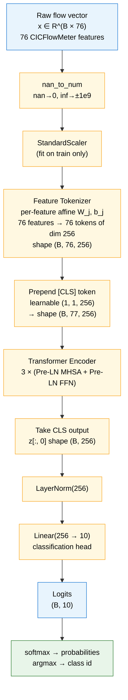
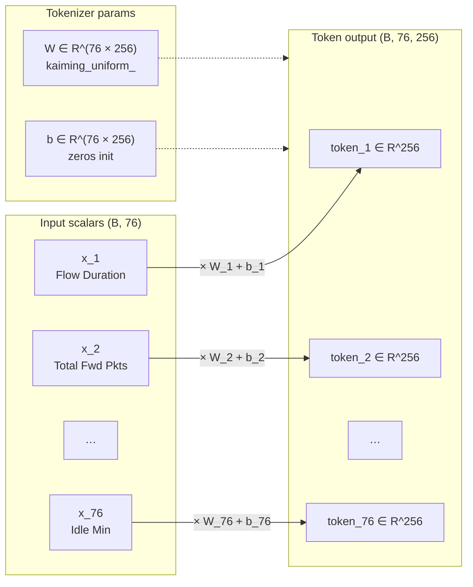
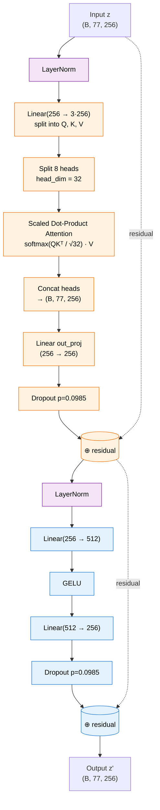
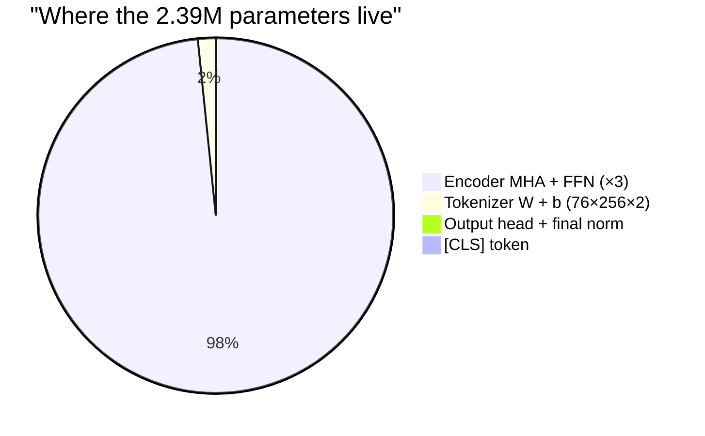
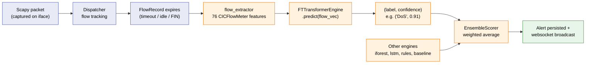
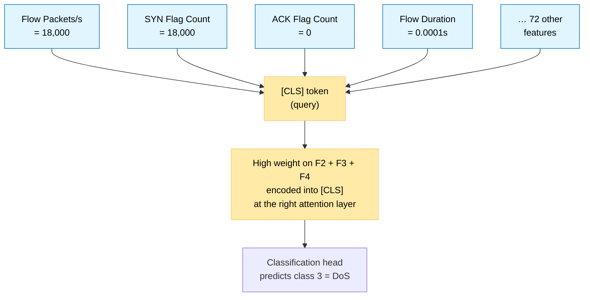

# Unified FT-Transformer — Architecture Diagrams

Visual companion to [`UNIFIED_MODEL.md`](UNIFIED_MODEL.md). Use this when you
need to *see* what the model does end-to-end. Numbers correspond to the
production tuned configuration:

| Hyperparam | Value | Meaning |
|---|---|---|
| `n_features` | 76 | CICFlowMeter flow features per sample |
| `n_classes` | 10 | Output classes (UNSW-NB15 schema) |
| `d_token` | 256 | Embedding dim per feature token |
| `n_blocks` | 3 | Transformer encoder layers stacked |
| `n_heads` | 8 | Attention heads per layer (head_dim = 32) |
| `ff_factor` | 2.0 | FFN hidden = `d_token * ff_factor = 512` |
| `dropout` | 0.0985 | Used inside attention + FFN |
| Total params | ~2.39M | (see §4) |

---

## 1. Top-level data flow

The model is a tabular Transformer: every numeric feature becomes its own
token, a [CLS] token is prepended, all tokens self-attend, and the [CLS]
output is classified.



The *only* part of the encoder output used by the classification head is
position 0 (the [CLS] token). All 76 feature tokens are present so they can
deposit information into [CLS] via attention; their final values are
discarded.

---

## 2. Feature Tokenizer

Each scalar feature `x_j` is independently projected to a 256-dim vector
via its own learned affine transformation:

```
token_j = x_j · W_j + b_j        with W_j, b_j ∈ R^256, j = 1..76
```

In code (broadcast over the batch):

```python
# tokenizer_w shape (76, 256), tokenizer_b shape (76, 256)
tokens = x.unsqueeze(-1) * self.tokenizer_w + self.tokenizer_b
# tokens shape: (B, 76, 256)
```



**Why per-feature affine instead of shared embedding?** Each CICFlowMeter
feature has its own scale and statistical role (a flag count vs a packet
length vs an inter-arrival time). Giving each feature its own
`W_j, b_j` lets the model learn an embedding tailored to that feature's
distribution, instead of forcing 76 heterogeneous quantities through a
single shared linear layer.

---

## 3. Transformer encoder block (×3, Pre-LayerNorm)

After tokenization and CLS-prepend, the sequence has length 77 (76
features + CLS). Three identical encoder blocks process it. Each block is
Pre-LN: LayerNorm is applied *before* attention and FFN, and residuals are
added *after*.



### Multi-head attention math

For one head (of 8), with `head_dim = 32`:

```
Q, K, V = LayerNorm(z) · W_q,k,v     # each (B, 77, 32)
A       = softmax(Q · Kᵀ / √32)      # attention weights (B, 77, 77)
head    = A · V                      # (B, 77, 32)
```

The 8 heads run in parallel; their outputs are concatenated back to
`(B, 77, 256)` and projected once with `out_proj` (256→256).

The attention matrix `A` is 77×77, so every token (including CLS) attends
to every other token. This is the only place where features interact with
each other in the model — the FFN operates on each token independently.

### Pre-LN vs Post-LN

`norm_first=True` is set on `nn.TransformerEncoderLayer`. Pre-LN was chosen
because it gives more stable gradients early in training and matches the
Pre-LN variant used in Gorishniy 2021. With Post-LN the model often needs
warmup to avoid divergence; Pre-LN trains cleanly without it.

---

## 4. Parameter budget



Per-component breakdown (approximate):

```
Tokenizer W       :   76 × 256                     =    19,456
Tokenizer b       :   76 × 256                     =    19,456
[CLS] token       :    1 × 1 × 256                 =       256
Encoder layer ×3  :  ≈790,000 each (attn ~263k + FFN ~263k + norms + biases)
                                                      ≈ 2,370,000
Final LayerNorm   :  256 × 2                       =       512
Head Linear       :  256 × 10 + 10                 =     2,570
                                                   ─────────────
Total             :                                ≈ 2,431,706
```

The encoder dominates. Most of *that* is the 8-head attention's QKV
projection (256 → 768 = 3·256) and the FFN's two linears (256 → 512 →
256), repeated 3 times.

---

## 5. From flow to alert (cnds runtime)

How the model fits into the cnds detection pipeline at inference time:



The FT engine substitutes for the legacy `SupervisedEngine` (Random
Forest) in the cnds registry — same `is_available` /
`predict(flow_features)` / `anomaly_score(flow_features)` interface, so
the rest of the pipeline (ensemble, dedup, persistence, websocket) is
unchanged.

---

## 6. Where attention helps

The attention block is what makes FT-Transformer beat the gradient-boosted
baseline on minority classes. Concrete picture: if a flow has high
`SYN Flag Count` AND low `ACK Flag Count` AND high `Flow Packets/s`, those
three features individually look like normal short connections, but their
*combination* is a SYN-flood signature.



XGBoost handles this kind of interaction implicitly via tree splits, but
splits over the 76-feature space struggle when the discriminating
combination involves rare values. Attention lets the model weight any
subset of features simultaneously — the conditional structure is learned
end-to-end rather than encoded as a fixed split path.

---

## 7. References to source code

| Concept | File | Symbol |
|---|---|---|
| Class definition | [`cnds/src/models/ft_transformer.py`](../../cnds/src/models/ft_transformer.py) | `FTTransformer` |
| Optuna sweep | [`notebooks/ft_transformer_optuna_sweep.py`](../notebooks/ft_transformer_optuna_sweep.py) | `objective`, `class FTTransformer` |
| Inference engine | [`cnds/src/engines/ft_transformer_engine.py`](../../cnds/src/engines/ft_transformer_engine.py) | `FTTransformerEngine.predict` |
| Smoke test | [`cnds/scripts/smoke_test_ft_unified.py`](../../cnds/scripts/smoke_test_ft_unified.py) | `predict_batch` |
| Live runbook | [`cnds/doc/UNIFIED_FT_LIVE_RUNBOOK.md`](../../cnds/doc/UNIFIED_FT_LIVE_RUNBOOK.md) | (manual hping3/nmap) |
